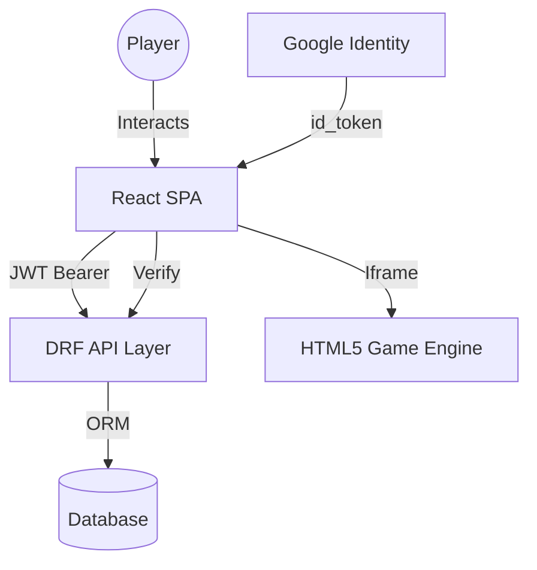

# GameHub: Technical Documentation (v2.0.0)

Welcome to the technical deep-dive of **GameHub: Cosmic Edition**. This document provides an engineering overview of the system architecture, authentication protocols, and integration engines.

---

## 🏗️ System Architecture

GameHub uses a **Stateless Decoupled Architecture** built for speed and horizontal scalability.

-   **Frontend**: Built with **React 19** and **Vite 7**. It utilizes a "Mobile-First" responsive strategy and Framer Motion for high-fidelity animations.
-   **Backend**: A **Django 4.2+ REST Framework** server handling business logic, data persistence, and security.
-   **Database**: SQLite for development; configured for **PostgreSQL** in production environments.
-   **PWA**: Service workers via `vite-plugin-pwa` enable offline capabilities and a native-app experience.

### Component Logic Flow

---

## 🔐 Authentication Ecosystem

### 1. JWT Implementation
We implement stateless session management via `djangorestframework-simplejwt`.
-   **Access Token**: 24-hour lifetime.
-   **Refresh Token**: 7-day lifetime with rotation enabled.
-   **Interceptors**: Axios interceptors handle automatic `401` retries using the refresh token.

### 2. Google OAuth 2.0 (`id_token` Flow)
To bypass Cross-Origin-Opener-Policy (COOP) complications with popups:
-   **Frontend**: Uses `@react-oauth/google` with the `<GoogleLogin>` iframe-based component.
-   **Backend**: Verifies the `id_token` (credential) using the `google-auth` Python library. This eliminates the need for extra network calls to Google's userinfo endpoint.

### 3. Password Recovery
-   **Flow**: Email-based token generation using Django's `default_token_generator`.
-   **Protocol**: UID + Token validation ensures secure password resets without existing session state.

---

## 📡 API Architecture

All endpoints are served under the `/api/` prefix.

### Core Endpoints
| Category | Endpoint | Method | Payload |
| :--- | :--- | :--- | :--- |
| **Auth** | `/api/auth/login/` | `POST` | `username`, `password` |
| **Auth** | `/api/auth/register/` | `POST` | `username`, `email`, `password1/2` |
| **Auth** | `/api/auth/google/` | `POST` | `credential` (id_token) |
| **Auth** | `/api/auth/password-reset/` | `POST` | `email` |
| **User** | `/api/profile/` | `GET` | *Requires JWT* |
| **Data** | `/api/leaderboard/` | `GET` | Global Rankings |
| **Stats** | `/api/save-score/` | `POST` | `game_id`, `score` |

---

## 📱 Progressive Web App (PWA)

GameHub is fully PWA-compliant.
-   **Manifest**: Defines cosmic theme colors (`#050508`) and high-res icons.
-   **Smart Prompt**: The `PWAInstallPrompt` component uses `localStorage` to ensure the "Download App" banner only appears once per user. If dismissed, it is suppressed to maintain a premium UX.
-   **Protocol Headers**: Vite is configured with `Cross-Origin-Opener-Policy: same-origin-allow-popups` to support secure OAuth flows.

---

## 🛠️ Engineering Workflows

### Styling Logic
-   **Tailwind CSS 4**: Utilizes a zero-runtime approach. Cosmic design tokens (Neon Blues, Purples) are defined as CSS variables in `index.css`.
-   **Micro-interactions**: Framer Motion handles layout transitions and component entry animations.

### State Orchestration
**Zustand** manages the global `authStore`.
-   **Persistence**: Auth state is synced with `localStorage`.
-   **Interactivity**: Stores player stats, high scores, and sync states.

---

## 🚢 Production Configuration

### Security Headers
The server must be configured with:
-   `Cross-Origin-Opener-Policy: same-origin-allow-popups`
-   `Access-Control-Allow-Credentials: true`

---

  <i>Documentation version 2.0.0 | Refactored for Cosmic Edition Hybrid Architecture | Last Updated: 10-03-2026 | By Chirag1724</i>

